# Wearable cough sensor using Edge Impulse
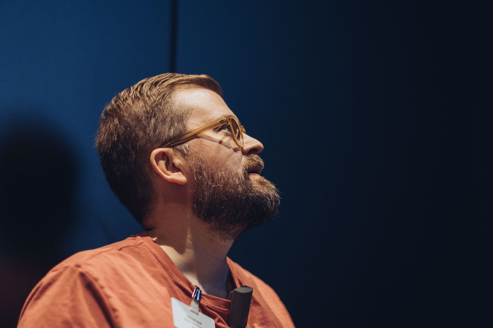

*Photo: Marthe Mølstre*

## Intro
This wearable device detects and reports user's coughs. This can be useful in treatment of patients suffering from chronic obstructive pulmonary disease, COPD, a group of diseases that cause airflow blockage and breathing-related problems. The increase in number and intensity of coughs can indicate ineffective treatment. Real-time monitoring enables caregivers to intervene at an early stage.

*Device demonstration.*

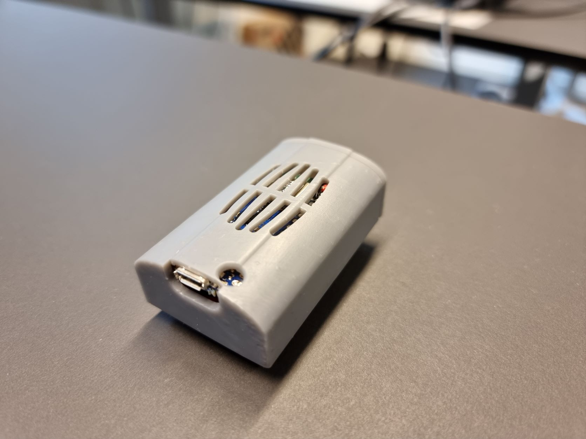

*Working prototype.*

## Advantages over existing solutions
Using cough frequency and intensity as and indicator of COPD condition has [proven useful, but impractical to monitor over time](https://www.ncbi.nlm.nih.gov/pmc/articles/PMC2707150/) outside hospital wards using existing technology. The main traditional approach consists of audio recording a patient at ward, then using manual or software based cough counting. While developing this new proof-of-concept no similar approaches were found.

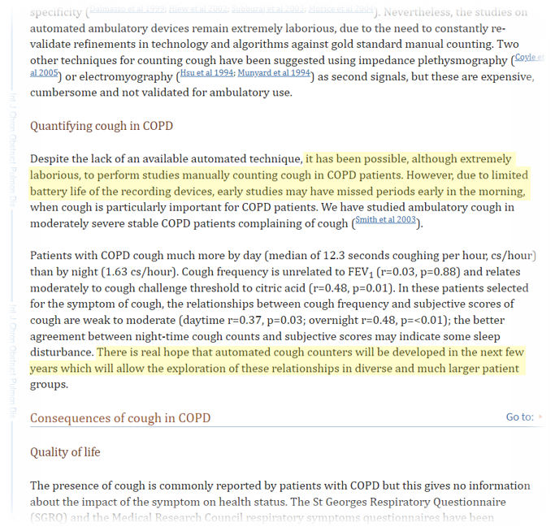

*Cough and its importance in COPD, PMC2707150*

## Privacy
Existing methods of analyzing audio recordings greatly invades privacy of the patient, caregivers and peers. This proof-of-concept does not store any audio for more than a fraction of a second. This audio buffer never leaves the device, it is constantly being overwritten as soon as the application has determined if the small fragment of audio contains a cough or not. In fact, the hardware used is not capable of streaming audio using the low-energy network in question.

Further, the application is hard-coded to detect coughs or noise. To be able to detect new keywords, for instance "bomb", or "shopping", the device would have to be physically reprogrammed. Firmware Over-the-Air is not currently supported in this project. Each keyword consumes already constrained memory, limiting the practical amount of different keywords to a handfull.

Compared to commercial voice assistants, such as Google Nest, Amazon Alexa or Apple Siri on dedicated devices or on smartphone, this device works a bit differently. The aforementioned products are split into two modes: activation and interpretation. Activation runs continously locally on the device and is limited to recognizing "Hey google" etc. This puts the device in the next mode, interpretation. In this mode an audio recording is made and transmitted to servers to be processed. This opens up for greatly improved speech recognition. It also opens up to secondary use, better know as targeted advertisement. The device in this project only works in the activation mode.

## Hardware, software, tools and services used
+ Arduino Nano 33 BLE Sense
+ LiPo battery
+ JSH battery connectors
+ Edge Impulse Studio
+ VS Code/Arduino IDE
+ Nordic Semiconductor nRF Cloud
+ nRF Bluetooth Low Energy sniffer
+ Nordic nRF52840 Dongle
+ Fusion 360
+ 3D printer
+ Qoitech Otii Arc

## How it works
A model was trained to distinguish intense coughs from other sounds. An Arduino Nano 33 BLE Sense was programmed to continously feed microphone audio into an application. The application then runs inference on small audio fragments to determine the probability of this fragment containing a cough. If it does, a counter is incremented and this is securely advertised using Bluetooth Low-Energy, BLE. An other BLE device, such as a smartphone or a USB-dongle, can be paired with the device and re-transmit the event to a service on the internet. I have used [Nordic nRF Cloud](https://nrfcloud.com/) for this purpose. nRF Cloud exposes several APIs (REST web services, MQTT brokers) that enables the events to be integrated with other systems. With this as a basis it's possible to transform the event into an internationally clinically recognizable message that can be routed into an Electronic Medical Record system, EMR. Popular standards include openEHR and HL7 FHIR.

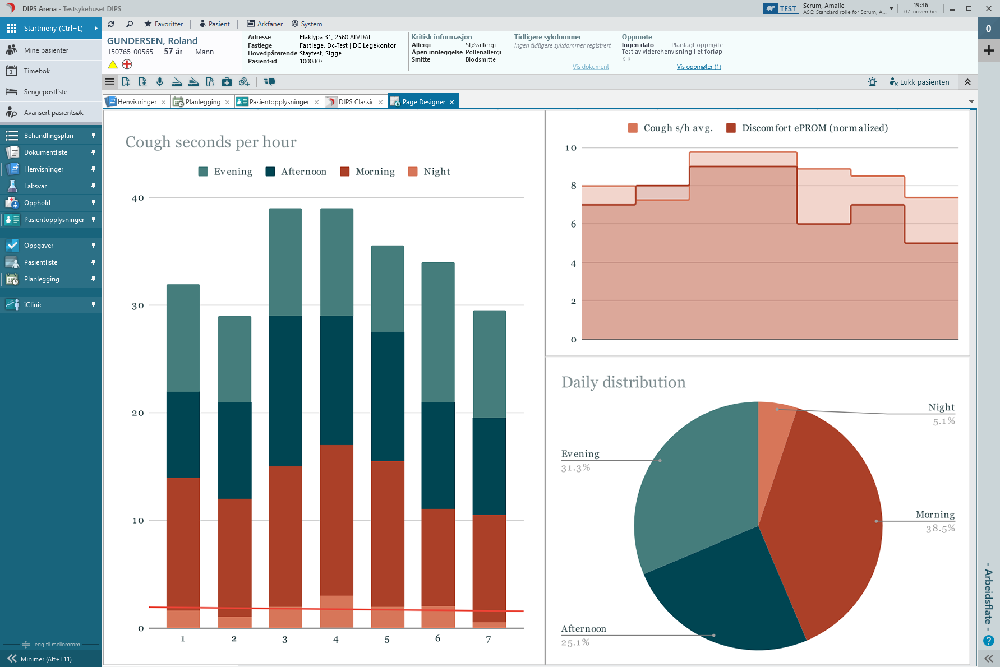

*Sensor data in patient's medical record, DIPS Arena, used in Norwegian hospitals.*

## Edge Impulse
[Edge Impulse](https://www.edgeimpulse.com/) is the leading development platform for machine learning on edge devices and it's free for use by developers. The [documentation](https://docs.edgeimpulse.com/docs) is some of the best I have experienced in my two decades as a professional developer. I also wish to recommend the book [TinyML Cookbook by Gian Marco Iodice](https://www.amazon.com/TinyML-Cookbook-artificial-intelligence-ultra-low-power/dp/180181497X) as a practical, project based introduction to TinyML and Edge Impulse. I will highlight some particulars of my application. You may explore my [project here](https://studio.edgeimpulse.com/public/105885/latest).

A model was trained using 394 labeled audio samples of intense coughs, a total of 2 minutes and 34 seconds. An almost equal amount of audio samples of less intense coughs, sneezes, clearing of throat, speech and general sounds was also labeled, 253 samples, 2 minutes and 38 seconds. All samples were captured using the Arduino Nano, positioned at the intended spot for wear.

*Edge Impulse Studio data.*

My coughs lasts around 200 milliseconds. I sampled 10 seconds of repeated coughing with short pauses, then split and trimmed the samples to remove silence.

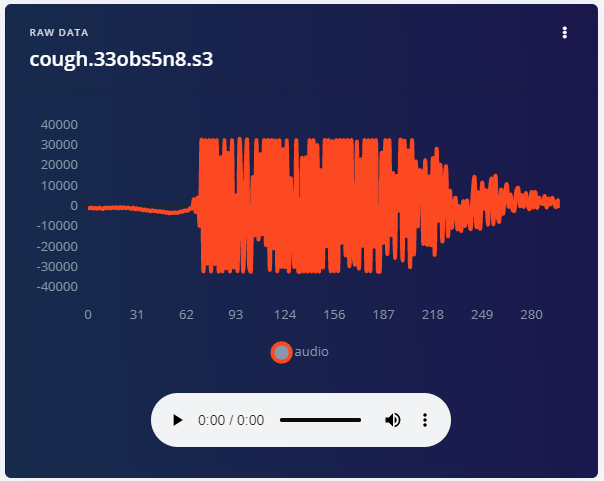

*Edge Impulse Studio data.*

I am the only source of the coughs, if this is to be used by anyone else a significantly larger and more diverse dataset is needed. I have found several crowd-sourced [datasets of coughs](https://www.kaggle.com/datasets/andrewmvd/covid19-cough-audio-classification), thanks to efforts during the covid pandemic. I started this project by making Python scripts that would filter, massage and convert these samples. The quality of many of the samples were not suitable for my project, many 10-second samples only contained a single, weak cough. Very few were accurately labeled. Due to the amount of work required to trim all of these and to manually label each sample, I decided to produce my own. Labeled datasets of [environmental audio recordings](https://github.com/karolpiczak/ESC-50) are also readily available.

The samples were split for training (81%) and 19% were put aside for testing. The training samples were used to extract audio features and create a neural network classifier. The NN architecture and parameters were mainly the result of experimentation. [Tutorials](https://create.arduino.cc/projecthub/edge-impulse/cough-detection-with-tinyml-on-arduino-417f37) and books gave conflicting and outdated advice, but were still useful for understanding the different steps. Edge Impulse Studio is perfect for this type of iterative experimentation, as it replaces a lot of custom tooling with beautiful UI.

*Creating impulse.*

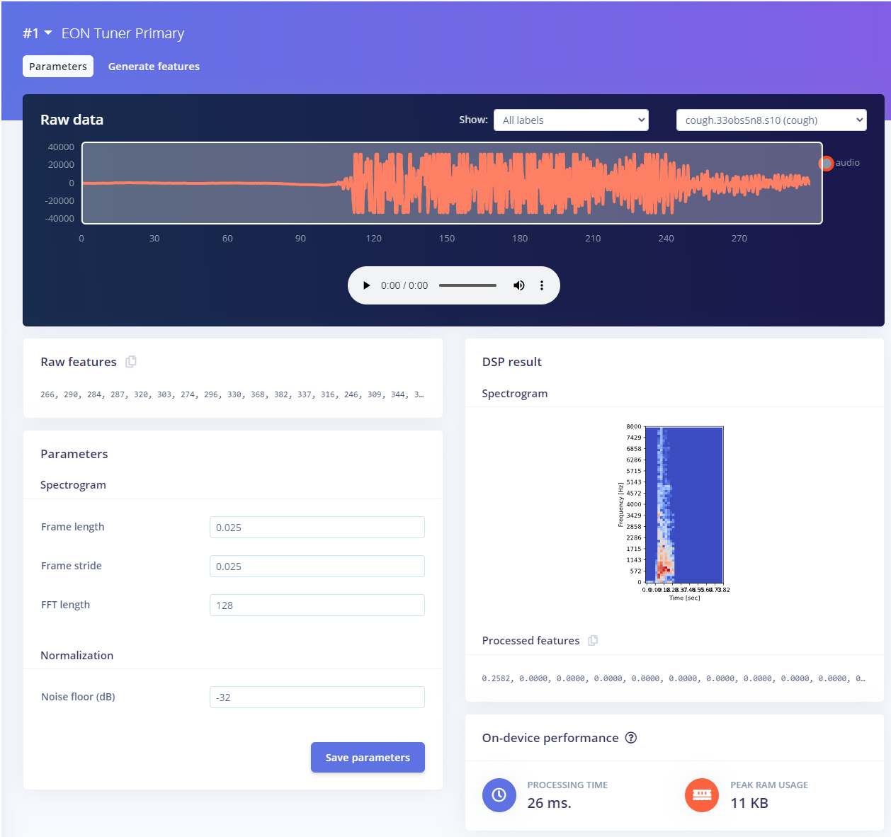

*Extracting features.*

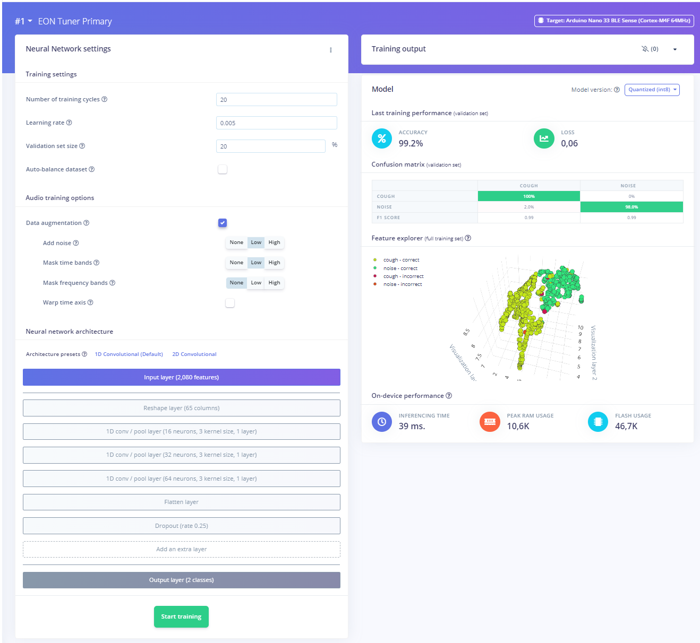

*Classifier and training performance.*

The model was tested using data set aside and yielded great results. I used EON Tuner in Edge Impulse Studio to find optimal parameters for accuracy, performance and memory consumption.

An Arduino compatible library was built and used to perform continuous interference on an Arduino Nano 33 BLE Sense audio input.

## Programming Arduino application
The Arduino ecosystem is wonderful for this kind of explorative prototyping. [Setting up the Arduino Nano for programming](https://docs.arduino.cc/hardware/nano-33-ble-sense) using Visual Studio Code or Arduino IDE/web IDE was a breeze and access to e.g. BLE-APIs was intuitive. You may explore the [source code here](https://github.com/eivholt/cough-monitor).

I followed some samples on how to use the generated Arduino libraries from Edge Impulse and how to perform inference on the audio input. If attempting to build my source code, make sure to include the /lib folder. I had to experiment a bit with parameters on the lenght of the audio window and slices. As each audio sample might start and end in any number of places for a given cough, each piece of audio is analyzed several times, preceeding and following ajoining samples. The results of the inference, the classification, is checked and triggers cough increment if probability is above 50%. A LED is flashed as an indicator.

If you are used to RPC or even REST types of communication paradigms, BLE will require a bit of reading and experimentation. The [docs over at Arduino](https://www.arduino.cc/reference/en/libraries/arduinoble/) give great explanation of key concepts and sample code to get started. Nordic also have [insightful webinars on BLE](https://youtu.be/5TxUnbsHsR8).

In short my application defines a custom BLE service, with a characteristic of type unsigned integer, with behaviors Notify, Read and Broadcast. Not very sophisticated, but enough for demonstration. Any connected device will be able to subscribe to updates on the value.

I used a [Nordic nRF52840 Dongle](https://www.nordicsemi.com/Products/Development-hardware/nrf52840-dongle) in conjunction with nRF Connect for Desktop Bluetooth Low Energy sniffing app for initial BLE development.

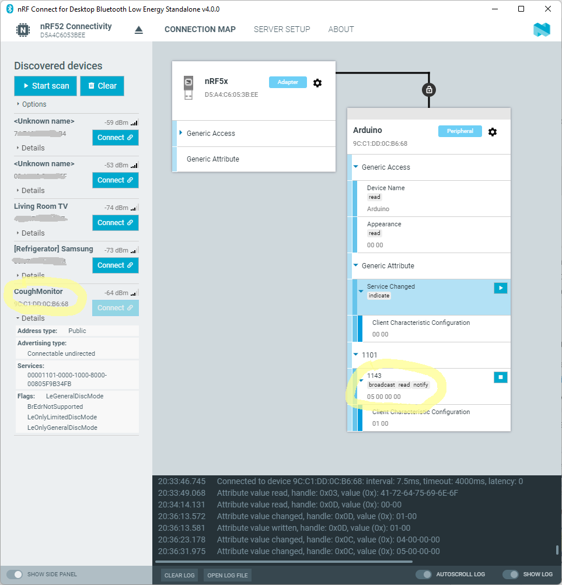

*nRF Connect for Desktop Bluetooth LE sniffer. 5 coughs are reported.*

## Nordic nRF Cloud
Next I used the nRF Android app on my phone as a gateway between the device and nRF Cloud.

*Phone acts as gateway between device and nRF Cloud.*

## Energy consumption profiling
I didn't spend a whole lot of time profiling and optimizing this project, as I would be moving to different hardware in the next iteration. Remember, the current implementation is simultaniously buffering audio from the microphone and performing inference. The key to long battery life is 1) energy efficient hardware and 2) as much down time (deep sleep) as possible. I did however make sure it could perform continuous inference for a few days. The [Otii Arc by Qoitech](https://www.qoitech.com/products/) is an excellent tool for profiling projects like this. Please see my other projects at Hackster and element 14 for more in-depth tutorials.

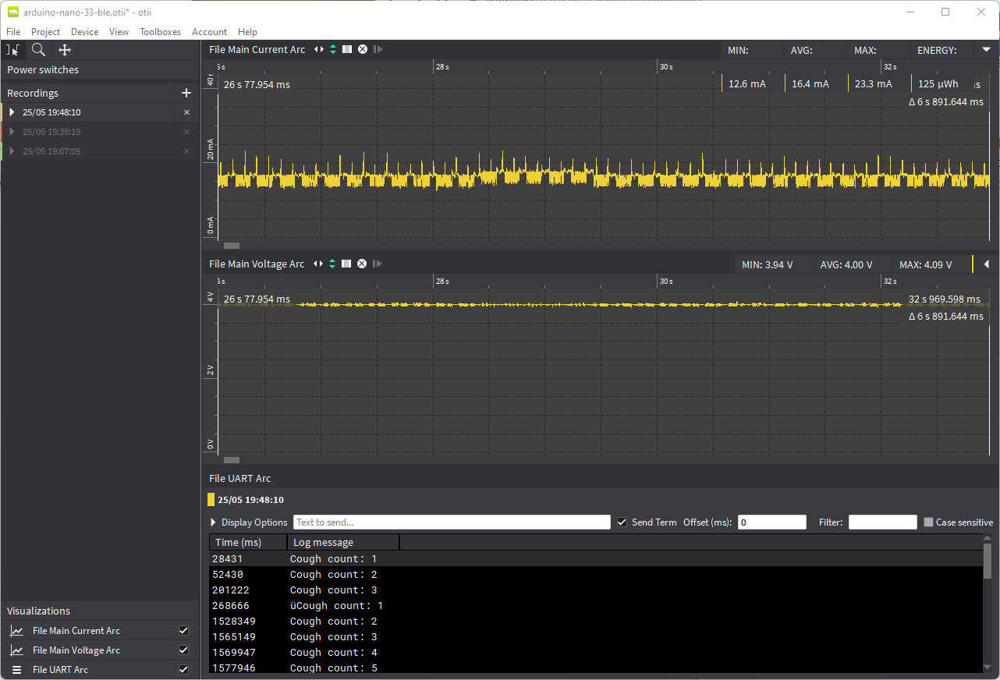

*Otii Arc.*

## Energy source
I used lithium polymer batteries for compact size and ease of recharging. I only had spare 500 mAh batteries available, shipping options for assorted batteries by air is limited. To extend battery life I connected two in parallel by soldering 3 JSH female connectors. Warning: This wiring is subjectable to short circuit and is only connected under supervision. This gives twice the capacity while keeping the voltage at the same level.

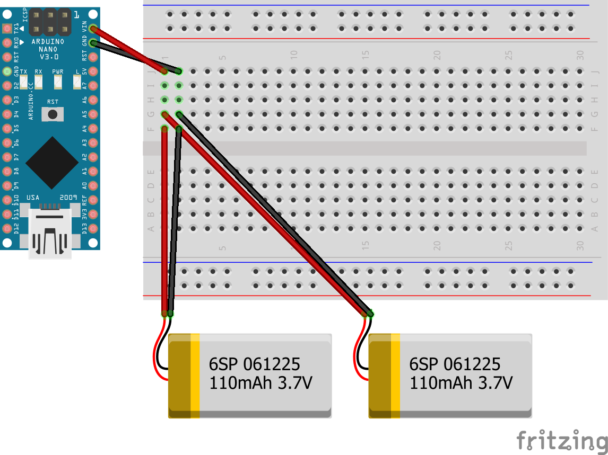

*Batteries connected in parallel.*

## Electronics work
I made the mistake of assuming I would have to connect more components to the Arduino Nano via a protoboard. On a whim I ordered the Nano with pre-soldered headers. This only took up space and I had to undergo the tedious work of removing the headers by hand using a regular soldering iron. Sacrificing the headers by snipping them every other pin greatly eased the required finger acrobatics.

*Ready for assembly.*

The only other thing I did was solder a female JSH battery connector to pins VIN and GND. This would serve as my battery connection, and subsequently the device's on/off toggle.

## Physical prototype
I wanted to make a prototype for demonstrating the concept for clinicians. It needed to contain and protect the electronics and batteries, while allowing sound waves to reach the microphone. I realized this would complicate making the enclosure watertight and quickly crossed that off the list. I also wanted to make a practical mechanism for securing the device on the wearer.

I used Autodesk Fusion 360 as CAD to design the enclosure. I always start by making rough digital replications of the hardware using calipers to take measurements on a sketch.

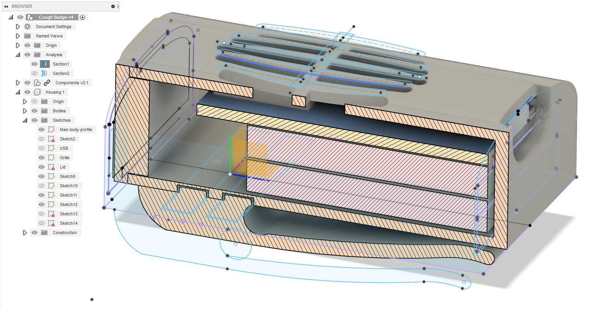

*Fusion 360 cross-section.*

This gives the driving constraints and allows me to experiment with different hardware layouts without having to totally scrap alternatives.

While designing I constantly need to take into consideration the manufactoring method, in this case a resin-based SLA 3D printer. When drawing I have to decide on the orientation of the model during printing to avoid complicating overhangs, cupping, hard-to-reach surfaces for removing support material. I also want to reduce the number of parts, to avoid unnecessary post-print work and bad fits.

The model was printed using a Formlabs 3 SLA 3D printer, with rigid Formlabs Gray v4 resin. The process starts by exporting the models as [high definition .stl files](https://github.com/eivholt/cough-monitor/tree/main/CAD) from Fusion 360. These are imported and arranged for printing using the PreForm software. There are many considerations in arranging the models for optimal print, carefully oriented parts and support material placement can drastically save post-print work, increase strength and surface finish.

*PreForm.*

*Ever expanding IoT lab. Photo: Sebastian Loraas*

Completed prints undergo an IPA wash to remove excess resin and finally post cure in a UV-light chamber. What remains is to snip off support material, sand any uneven surfaces and glue together parts. Now the device could finally be assembled and tested.

*UV curing.*

I ended up with a sort of a badge with a clip and a friction fit lid. It reminds me of a 1960's Star Trek communicator, not the worst thing to be compared against.

*Clothes clip.*

## Limitations
Battery life is limited to a few days. I am in the process of reimplementing the device using a Neural Decision Processor, NDP, that is able to perform the inference with a fraction of the energy a conventional MCU requires.

I tried to limit audio inference to only perform when the Arduino Nano accelerometer triggers due to some amount of movement (chest movement during a cough). I was disappointed to discover that the interrupt pin on the LSM9DS1 IMU is not connected to the MCU.

You might also have realized that the device will pick up coughs by bystanders, something I discovered when demonstrating the device to a large audience during a conference! Limiting activation to both movement and audio will sort this out.

*Action shot.*

## Future improvements
When demonstrating the device to doctors and nurses I received a great suggestion. A COPD patient that stops taking their daily walk is a great source for concern. My device could be extended to perform monitoring of physical activity using accelerometer data and report aggregated daily activity.

It might be useful to support simple keywords so a patient could log events such as blood in cough, types of pain, self-medication etc.

I plan to move from BLE to LoRaWAN or NB-IoT for transmissions. This way patients won't have to worry about IT administration or infrastructure, it will just work. Please see my other projects at Hackster and element 14 for demonstrations of these lpwan technologies.

## Reception
I have had the opportunity to demonstrate the device to clinicians both in person and at expositions and it has received praise, suggestions for further features and use in additional conditions. This project has also spawned several other ideas for wearables in e-health.

*Eagerly awaiting to enter the stage at DIPS Forum 2022. Photo: Marthe Mølstre*

## Disclosure
I work with research and innovation at [DIPS AS](https://www.dips.com/). I am a member of Edge Impulse Expert Network. This project was made on my own accord and the views are my own.